# Introduction - Hoot 2 Tweet

## Goal

This example project should use Hoot's new AndrOAuth library to make requests to Twitter. It should be full featured, yet simple and the AndrOAuth integration should be easily understood by new programmers.

## Scope

### Target
Version 1.0 - Should be finished by April 1st, 2013

### Device
The app should scale well with android devices with 3.2 inch screens to 10.1 inch screens. This will be done by having both specific resources for different device sizes and resources which can intelligently adapt.

### Android Firmware
As Hoot's and AndrOAuth's minium api level is 8, this twitter example application will follow suit. To leverage modern UI practices, compatibility libraries will be used as sub models.

### Twitter Login
This will be accomplished with a fragment containing a webview. This will be module with few/no dependencies other then AndrOAuth so that it can easily be reused by other projects.

### Twitter API
A TwitterHelper class and Api.classes will be made with standard Twitter REST API v1.1 calls and their summary from https://dev.twitter.com/docs/api/1.1. These will be a module with few/no dependencies other then AndrOAuth so that they can easily be reused into other projects.

# Design Stories

#### Application Icon
- ic_launcher.png

    

#### Application Colors
- $tt-red: #e1261c
- $dark-gray: #333333
- $mid-dark-gray: #4c4c4c
- $mid-gray: #666666
- $mid-light-gray: #999999

#### Application Text Styles
    .nav-item-text-primary {
        font-size: 22sp;
        font-family: "Roboto";
        color: white;
        text-align: left;
    }

    .nav-item-text-secondary {
        font-size: 12sp;
        font-family: "Roboto";
        color: $mid-gray;
    }

    .nav-user-stats {
        font-size: 18sp;
        font-family: "Roboto";
        color: $mid-light-gray;
        text-align: center;

        &.metric {
            font-weight: bold;
            font-size: 12sp;
            color: $mid-dark-gray;
        }
    }

# Application Layout

The application is broken down into 10 sections in this spec document:

1. [Main](#1-main)
2. [Standard Feed](#2-standard-feed)
3. [Message Box](#3-message-box)
4. [Twitter Feed](#4-twitter-feed)
5. [Mentions](#5-mentions)
6. [Profile](#6-profile)
7. [Messages Fragment](#7-messages-fragment)
8. [Action Bar](#8-action-bar)
9. [Login](#9-login)
10. [Mockups](#10-mockups)

# 1 Main

Main is the activity in the application which houses all of the fragments which the user interacts with other then the Login Fragment.

## 1.0 Main Sliding Menu

### Stories
- The user should be able to navigate the app by Sliding the main/resting position (Main Fragment) to the right
- The user will get expanded information when tapping on an item by the Main Fragment sliding to the left menu, showing the Action Fragment

## 1.1 Main Fragment

The main fragment is the framelayout which the current main fragment resides in.

[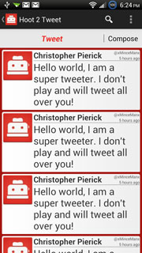](../Design/../Design/Screens/screen.jpg)
\* An example Main Fragment

### Stories
- The user changes the main fragment with the Navigation Menu
- The user will interact with the main fragment primarily by interacting with listviews but  also other UI elements
- When the user clicks an item in the Main Fragment the Main Fragment should slide to the left revealing the link target in the Action Fragment
- By sliding the Main Fragment to the right the user will reveal the Navigation Menu

## 1.2 Navigation Menu

Interacting with the Navigation Menu changes the Main Fragment

[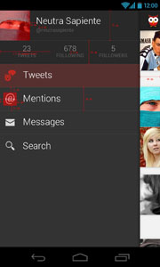] (../Design/Mockups/1_2_Navigation_Menu+REDLINES.jpg) "1_2_Navigation_Menu+REDLINES")

### Stories
- The user will be able to glance at their quick profile information within the navigation menu
    - Their avator and basic stats will be visible from here
	- By clicking on their profile they will be brought to that location in their profile in the main fragment.
- The user should know where they are in the app via highlight in the navigation menu
- By click on one of the items the user can navigate around the app.
- There are five items the user should be able to access from here: Profile, Tweets, Mentions, Messages and Search

### Design Stories
- Background: $dark-gray
- Cells
    - Pressed background: nav_cell_pressed.9.png
    - Dividers:

            .item-divider {
                background-color: white;
                width: 100%;
                opacity: 0.1;
                height: 1px;
            }
    - Text: .nav-item-text-primary
    - User profile cell:
        - Background: bg_bottom_shadow.9.png
        - Name: .nav-item-text-primary
        - Username: .nav-item-text-secondary
        - Stats: .nav-user-stats
    - Icons:
        - ic_menu_tweets.png
        - ic_menu_mentions.png
        - ic_menu_messages.png
        - ic_menu_search.png
- Right overhang shadow: nav_overhang_shadow.9.png

## 1.3 Action Fragment

This is used when needing to expand functionality of something selected in the Main Fragment

[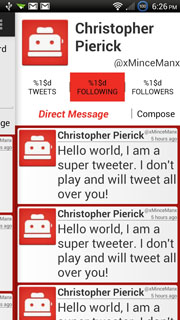](../Design/../Design/Screens/screen_4.jpg)

### Stories
- When a user clicks something in the Main Fragment(like an avatar) the Main Fragment should slide to the left revealing the link target in the Action Fragment to the user
- The user can close the Action Fragment by tapping or sliding the Main Fragment back, or hitting the back key.
- After the user closes the Action Fragment it will lock so the user must click on a link to open it again. This way the user will not be looking a stale data.

### Design Stories
- Main Fragment offset 35dp

# 2 Standard Feed
This is the standard listview/feed that displays feed information from twitter.

[ "Standard Feed screenshot")
\* The header is not apart of the Standard Feed

## 2.0 ListView

### Stories
- Each list item should give the user an impression of a card sliding across a background
- When a user clicks an avatar, that avatar's profile will open for the user
- When the user clicks a message the toolbar open will open on that card
- The Toolbar items are on a case by case basis so the user gets the optimal interactions out of them

### Design Stories
- toolbar buttons: 16sp
- card padding: 5dp
- card corner radius: 4dp
- card name: 20sp, bold
- card time stamp and @ = 10sp, #555, align-right
- card message: 25sp
- avatar: 80x80dp
- Shadowing: card should have shadowing
- listview background: #a61610

## 2.3 Toolbar

[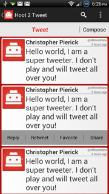](../Design/../Design/Screens/screen_5.jpg)
[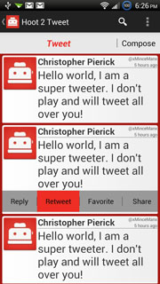](../Design/../Design/Screens/screen_6.jpg)

### Stories
- The Toolbar gives the user basic functions for interacting with each card/tweet
- The user will only see the toolbar when they want it 
- Only one toolbar at a time will be expanded to simplify the UI for the user.

### Design Stories
- Toolbar background: #999
- Shadowing: Toolbar should appear to be inset to the card with shadowing
- Should have 5 dp of white space below it with rounded corners.
- White space should have 5dp margin on Left, Right and Bottom

## 2.2 Animations

### Stories
- Toolbar will expand out with an animation

# 3 Message Box

Message Box should be handled as a bar that is expandable.

[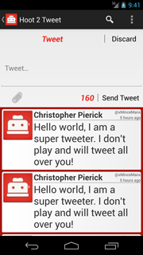](../Design/../Design/Screens/screen_1.png)
\* example usage of the MessageBox

## 3.0 Layout

### Stories
- Custom header text will tell the user what each MessageBox does
- To start writing a message the user presses the [Compose] button to open the MessageBox
- When the user presses the send button, the MessageBox will close and reset on success
- The user will see a toast letting them know if their message was sent successfully
- A character counter will always let the user know how many characters they have left.
- The attachment button will let the user attach pictures already on their device or take a picture with their camera.

### Design Stories
- header: H2, align-center
- character counter: 20sp, bold|italic, Two Toasters Red
- Attachment icon

## 3.1 Animations

### Stories
- Animations will occur when the user triggers the MessageBox to open or close
    - The word "Compose" should fade away and "Discard" should fade into its place, or vice versa.
    - a messaging area under the button should expand or collapse into existence accordingly.

# 4 Twitter Feed
This will be called the Tweets Fragment and will load the users standard twitter feed or "Home feed" into the Standard Feed.

## 4.0 Twitter Feed

### Stories
- The user should be able to easily tweet by using a MessageBox above of their feed
    - The user should be able to understand the use of the box by a "Tweet" header
    - Messaging area should have an edittext with a hint of "Tweet..."
    - The Send button should say "Send Tweet"
- The user will know if the tweet posted successfully via toast
    - On failure the MessageBox will not close and the send button will say "Retry"
- The user's tweeter feed will be displayed with the Standard Feed

## 4.1 Toolbar

### Stories
- The user will be displayed 4 options
    - If it is someone else's tweet [ reply | retweet | favorite | share ]
    - If it is a tweet by the user [ reply | delete | favorite | share ]
- When the user presses reply the MessageBox will open with relavent data filled in
- When the user presses retweet the MessageBox will open with relavent data filled in
- When the user presses delete, they will get a pop-up confirming the deletion
- When the user presses favorite will toast a success or failure.
- When the user presses share android's default share button will take over

# 5 Mentions

# 6 Profile

This fragment will display the users profile or someone else's.

## 6.0 Users Profile

[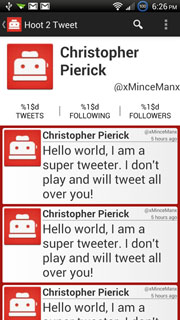](../Design/../Design/Screens/screen_9.jpg)

### Stories
- The User will be able to access their profile via the Navigation Menu
- The User will be able to to see the number of tweets, number of people they're following and number of followers they have.
- The User will be able to change the feed on the profile fragment by clicking on one of these buttons which will display the feeds of the related information.
- The user will be able to interact with the feeds just like in the tweets fragment

### Design Stories
-Avatar: leftTop, 100dp x 100dp, margin 10dp
-Name: center Upper, textSize=30sp, bold, align-text left
-user handle: textSize=20sp, under name, align-text right
-profile buttons: textSize=15sp

## 6.1 Someone else's Profile

[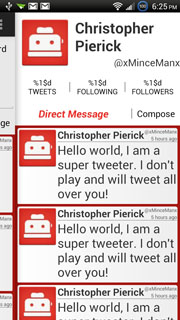](../Design/../Design/Screens/screen_2.jpg)
[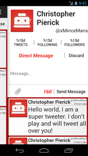](../Design/../Design/Screens/screen_3.png)

### Stories
- By clicking on some one's avatar in a standard feed the user will be able to view that person's profile in the Action Fragment
- The User will be able to to see someone's number of tweets, number of people they're following and the number of people following this person.
- The User will be able to change the feed on the profile fragment by clicking on one of these buttons which will display the feeds of the related information.
- The user will be able to send a direct message to the person who's profile this is by clicking on the compose button on the MessageBox.
    - The user will know what the Message Box does as the header should be "Direct Message"
    - A hint to the user will be the word "Message..." in the edittext box
    - The user will be able to click the "Send Message" button to send their message
    - The user will know that the message sent successfully by the MessageBox closing and a success toast

# 7 Messages Fragment

Accessed from the Navigation Menu

[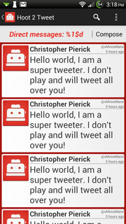](../Design/../Design/Screens/screen_12.jpg)
[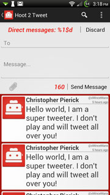](../Design/../Design/Screens/screen_13.jpg)

## 7.0 Messages Fragment

This Fragment is for Direct Message interaction.

### Stories
- The user should know how many direct messages they have by the MessageBox header
- The user will be able to send a Direct message to anyone by clicking the compose button and adding a handle into an edittext box with a hint of "To"
- The user will be able to put their message into an edittext with a hint of "Message..."
- The user will know the message succeeded with the MessageBox closing and a success toast
- The user will see the latest message in a conversation list on the standard feed. See 7.1
- When the user clicks a message in their standard feed the conversation list will load in the Action Fragment
- The user will know who the conversation is with via the avatar which will load that person's profile if the user presses it.
- The user will know if a conversation has a new message by indicator

### Design Stories
- The standard feed will have an indicator if it is a new message

## 7.1 Conversation list

This will let the user view the direct messages between them and someone else

### Stories
- The user will be able to view direct messages between them and someone else by a standard feed
- The user will be able to delete a message via the toolbar
- The user will know how many messages are in the conversation list via the MessageBox header
- The user can add/send a message to the conversation via the compose button on the MessageBox

# 8 Action Bar

[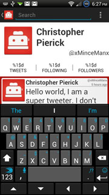](../Design/../Design/Screens/screen_10.jpg)

### Stories
- The user will be able to filter any current standard feed they are viewing with a Collapsible Search Button
- When the user signs out a confirmation dialog will pop-up
- After the user confirms signing out, the Login Fragment will become the Main Fragment

\* Note there are no Settings yet, but there will more then likely be network options.

# 9 Login
Logging in will be handled with a fragment

## 9.0 Login Fragment

[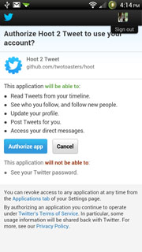](../Design/../Design/Screens/screen_15.jpg)

### Stories
- When starting the app, if the user has not logged in before or an unauthorized request is received, the user will be directed to the Login Fragment
- When the user is logging in they will not have access to the rest of the app
    - The ActionBar will be hidden from the user
    - The sliding menu will not respond to user interaction
- The user will see a webview view to log into

## 9.1 Loading web view

### Stories
- When the webview is loading the user will only see the loading screen
- The loading screen will tell the user that the app is "Hootin @ Twitter"
- The user will know that the app has not frozen by a toaster with blinking eyes set above the loading text
- The user will where the web view is in loading by a progress bar at the top of the screen

### Design Stories
- Loading Text: textSize=30sp, Two Toasters Red
- Eyeless toaster, we might want to use the new icon.
- two red dots for eyes, or whatever the eyes of the icon are.

## 9.2 Login Complete

### Stories
- On successful login the user will receive a success toast, the Tweets fragment will become the Main Fragment, and the sliding menu unlocked.

# 10 Mockups

## Tweets Fragment, Message Box closed

## Tweets Fragment, Message Box Open

## Profile Fragment as Action Fragment

## Profile Fragment as Action Fragment, message box open

## Profile Fragment as Action Fragment, button press

## Tweets Fragment toolbar expanded

## Tweets Fragment toolbar expanded, button press

## Navigation Menu

## Profile fragment as main

## ActionBar search

## ActionBar Overflow

## MessagesFragment

## MessagesFragment MessageBox Open

## LoginFragment Loading

## LoginFragment Authorize

